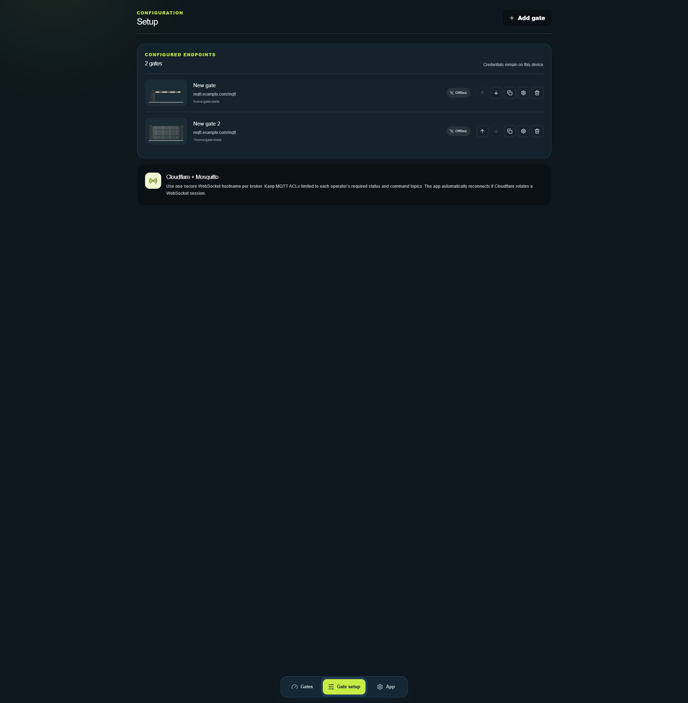
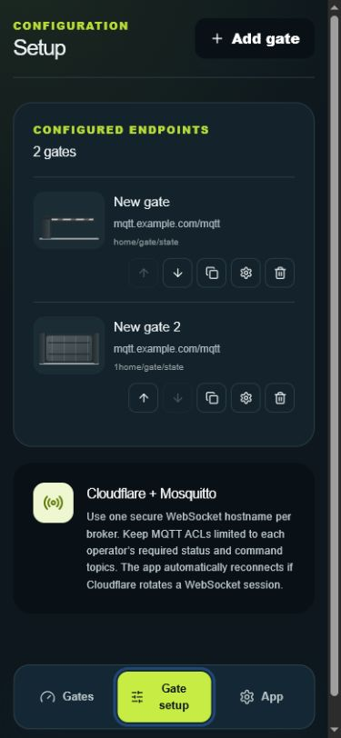
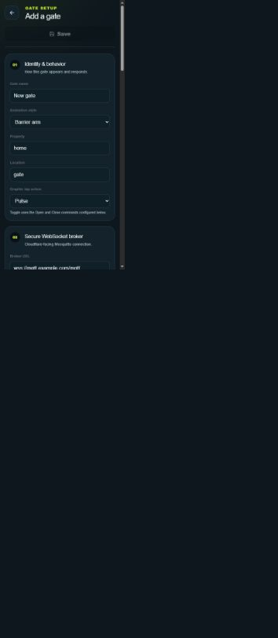
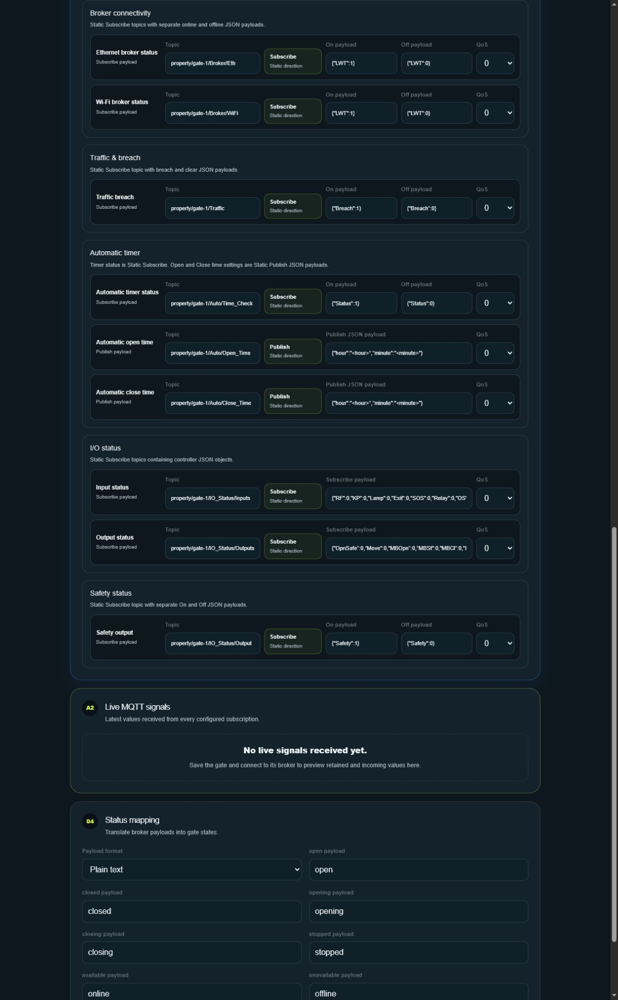
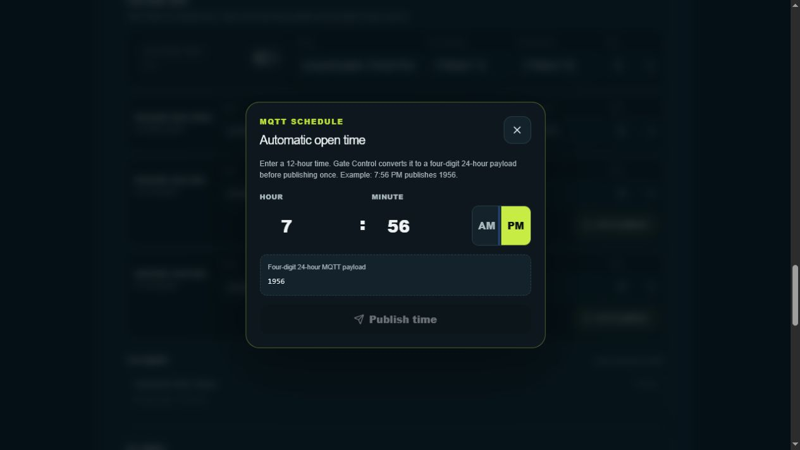

# Gate Control

Gate Control is an installable responsive web app for monitoring and controlling multiple gates through Mosquitto MQTT over secure WebSockets. It runs from Docker or CasaOS and connects each browser directly to the configured remote broker.

## What is included

- Adaptive cards, large-list, and compact dashboard layouts
- Sliding, swing, and barrier-arm status animations
- Dedicated gate page with Pulse, Open, and Close controls
- Per-gate WSS broker credentials, topics, payloads, MQTT version, QoS, and state parsing
- Case-sensitive Property/Location topic defaults; Pulse, Open, and Close share the `Property/Location` action topic
- Home Assistant-style defaults plus plain-text or JSON status mapping
- Add, edit, reorder, delete, and clone flows with duplicate endpoint prevention
- Pooled MQTT connections, keepalive, reconnect, authoritative status, non-retained actions, and debounce
- Device-local IndexedDB configuration and an installable PWA manifest

## Recommended CasaOS and Cloudflare layout

Use Cloudflare Tunnel rather than router port forwarding. The tunnel makes outbound connections from CasaOS, so no inbound broker or app ports need to remain open.

```text
gates.example.com             -> http://gate-control:3000
gate-one-mqtt.example.com     -> http://CASAOS_LAN_IP:9001
gate-two-mqtt.example.com     -> http://CASAOS_LAN_IP:9002
```

Mosquitto WebSocket listeners begin with an HTTP Upgrade request, so their Cloudflare Tunnel service is `http://`, while users configure `wss://gate-one-mqtt.example.com` in Gate Control. Cloudflare WebSockets must be enabled. Do not configure a Cloudflare Access login in front of MQTT hostnames unless the MQTT browser client can satisfy that separate authentication layer; use Mosquitto username/password and topic ACLs instead.

An example locally managed tunnel file is provided in `cloudflared-config.example.yml`. Replace all example hostnames, LAN addresses, and the tunnel UUID.

## Mosquitto listener example

Each broker must expose a WebSocket listener. When Cloudflare Tunnel terminates public TLS, the private listener can remain HTTP WebSocket on the trusted Docker/LAN network:

```conf
listener 9001 0.0.0.0
protocol websockets
allow_anonymous false
password_file /mosquitto/config/passwords
acl_file /mosquitto/config/acl
```

Give each operator only the minimum topic permissions required for their gates. Actions are published with `retain=false`, but the broker ACL should also prevent access to unrelated topics.

## Docker deployment

1. Replace `NEXT_PUBLIC_APP_URL` in `docker-compose.yml` with the app's public HTTPS hostname.
2. Build and run:

   ```sh
   docker compose up -d --build
   ```

3. Open `http://CASAOS_IP:3080` locally or publish port 3000 through Cloudflare Tunnel as the app hostname.

## CasaOS deployment

Gate Control publishes versioned multi-platform images to GitHub Container Registry:

```text
ghcr.io/mumbles1/gate-control:latest
ghcr.io/mumbles1/gate-control:v1.0.0
```

In CasaOS, select **App Store → Install a customized app → Import Compose**, then import `docker-compose.casaos.yml`. Use `latest` to follow the current stable release, or replace `latest` with a specific version such as `v1.0.0` to pin the installation.

The CasaOS app exposes local port 3080. Gate configuration is stored in each browser, so the app container requires no data volume or database.

### Complete CasaOS Compose example

Replace `YOUR_CASAOS_IP` with the LAN address of the CasaOS machine, then paste this YAML into CasaOS **Import Compose**:

```yaml
name: gate-control
services:
  gate-control:
    image: ghcr.io/mumbles1/gate-control:v1.0.0
    container_name: gate-control
    restart: unless-stopped
    environment:
      NEXT_PUBLIC_APP_URL: "http://YOUR_CASAOS_IP:3080"
    ports:
      - target: 3000
        published: "3080"
        protocol: tcp
    security_opt:
      - no-new-privileges:true
    cap_drop:
      - ALL
    x-casaos:
      envs:
        - container: NEXT_PUBLIC_APP_URL
          description:
            en_us: Gate Control WebUI address
      ports:
        - container: "3000"
          description:
            en_us: Gate Control WebUI
x-casaos:
  architectures: [amd64, arm64]
  main: gate-control
  author: Turnage Automation
  category: Home Automation
  description:
    en_us: MQTT multi-gate monitoring and control PWA
  icon: https://raw.githubusercontent.com/mumbles1/gate-control/main/public/icon-512.png
  index: /
  port_map: "3080"
  scheme: http
  title:
    en_us: Gate Control
```

CasaOS WebUI values: scheme `http`, host port `3080`, container port `3000`, and path `/`. No volume mounts are required.

Update a `latest` installation from the CasaOS interface, or from a terminal with:

```bash
docker compose -f docker-compose.casaos.yml pull
docker compose -f docker-compose.casaos.yml up -d
```

## Gate setup walkthrough

After Gate Control is running, open its Web UI and select **Gate setup** in the bottom navigation. Existing gates appear under **Configured endpoints**. Select **Add gate** to configure the first gate.



The same setup screen works on phones. Each configured gate includes controls for ordering, cloning, editing, opening advanced settings, and deleting.



### Add the gate and MQTT broker

In **Identity & behavior**, enter the gate name, Property, Location, animation style, and graphic tap action. Property and Location are case-sensitive and are used to build the Turnage Automation topic defaults.

In **MQTT broker**, enter the WebSocket connection supplied by the broker administrator:

- Protocol: normally `wss://` for remote access or `ws://` for trusted LAN testing
- Host: broker hostname or LAN IP address
- Port: the Mosquitto WebSocket listener port
- Base path: normally `mqtt`
- Encryption and certificate validation: enable both for `wss://`
- Username and password: use an MQTT account restricted to this gate's topics



Review every generated topic before saving. Gate Control blocks a save if any MQTT topic duplicates a topic assigned to another gate. Select **Test connection** to authenticate, subscribe to the configured status topics, and preview received values before saving.

### Advanced gate settings

Press and hold a gate's **Edit** button for five seconds to open **Advanced gate settings**. This page contains primary commands, broker status, traffic, automatic timer, RTC clock, input/output status fields, safety controls, live subscribed values, and gate-state mapping.



Automatic open and close times use a 12-hour picker in the app and publish the controller's required four-digit 24-hour payload.



Return to **Gates** and confirm that the gate shows **Connected** and reports its current state. Test controls while physically observing the gate and its safety devices.

Gate configuration and credentials remain in that browser's local device storage. Repeat the gate setup on every phone, tablet, or computer that will operate Gate Control. Adding the site to a mobile home screen does not synchronize configuration between devices.

## PWA installation

- Android/Chrome: open the HTTPS app URL and choose **Install app**.
- iPhone/Safari: open the HTTPS app URL, choose **Share**, then **Add to Home Screen**.
- Desktop: use the browser's install control.

HTTPS is required for service workers and a reliable installed-app experience. Clearing browser site data also clears saved gates and credentials.

## Security notes

- Browser storage is protected by the browser's same-origin boundary but is not equivalent to iOS Keychain or Android Keystore.
- Use unique, limited Mosquitto accounts and strong passwords; never use a broker administrator account.
- Serve only first-party app code with a restrictive Content Security Policy at the reverse proxy.
- Prefer Cloudflare Tunnel and close the router's forwarded Mosquitto/WebSocket ports after verifying the tunnel.
- Gate actuation can create a physical hazard. Add real-world obstruction detection and safety controls at the gate controller; this UI is not a substitute.

## Development and verification

```sh
pnpm install
pnpm dev
pnpm test
pnpm lint
```

`pnpm dev` listens on every network interface at port `3002`. Open
`http://YOUR_COMPUTER_LAN_IP:3002` from another device on the same network. If
Windows asks whether Node.js may accept connections, allow it on Private
networks only.

Production behavior should also be checked against each actual broker, especially its WebSocket path, Origin policy, retained status, availability payloads, and ACLs.
